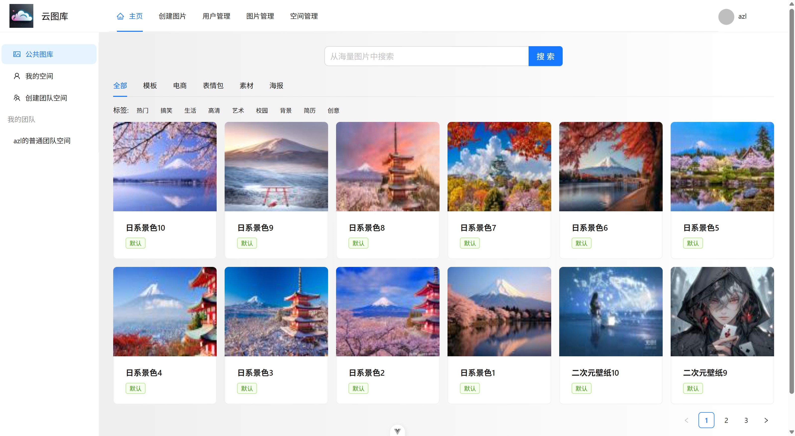
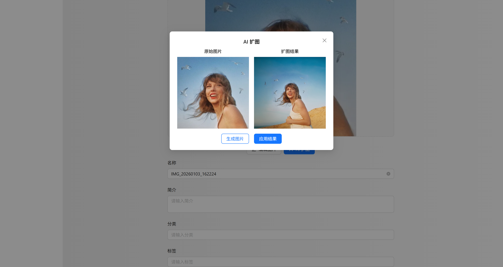

# 智能协作云图库平台（前端实现）

一个支持**多人实时协作编辑**、**AI扩图**、**多维度搜索**的现代图片管理与协作平台前端。

## 核心功能亮点

- 🖼️ 多维度图片搜索（关键词、标签、分类）
- ✍️ **实时多人协同编辑**（WebSocket + 编辑锁 + 冲突检测）
- 🪄 AI一键扩图（对接后端异步大模型任务）
- 📊 空间数据分析看板（ECharts 词云、趋势图等）
- 🚀 图片上传优化（拖拽 / URL / 进度条 / 失败重试）
- 🎨 图片编辑器（裁剪、旋转、缩放）
- 🔐 权限与路由控制（动态菜单 + 页面级权限）
- 📱 响应式布局

## 技术栈

| 分类       | 技术                             | 说明                       |
| ---------- | -------------------------------- | -------------------------- |
| 框架       | Vue 3 + `<script setup>`         | 组合式 API + 最新语法糖    |
| 构建工具   | Vite                             | 极速开发体验               |
| 语言       | TypeScript                       | 全项目类型安全             |
| 状态管理   | Pinia                            | 轻量、组合式、devtools友好 |
| UI 组件    | Ant Design Vue                   | 企业级组件库               |
| 网络请求   | Axios                            | 全局拦截器 + 类型安全响应  |
| 实时通信   | WebSocket (原生)                 | 心跳重连 + 事件总线封装    |
| 数据可视化 | ECharts 5                        | 动态图表 + 自适应          |
| 图片处理   | vue-cropper / file-saver         | 裁剪 + 下载                |
| 工程化     | ESLint + Prettier + husky        | 代码规范 + 提交检查        |
| API 生成   | OpenAPI / swagger-typescript-api | 自动生成类型安全的请求代码 |

### 项目核心结构

- **pages/**：所有路由对应的视图页面，按业务模块分组，便于定位和维护。
- **components/**：存放可复用组件，包含analyze文件夹，存放空间分析相关组件
- **stores/**：Pinia store，目前主要管理登录用户信息。
- **utils/**：放置通用工具函数，其中 `pictureEditWebSocket.ts` 是实时协作的核心实现。
- **router/**：集中管理路由和导航守卫，支持动态路由、权限控制。
- **constants/**：业务常量统一管理，避免魔法字符串散落在代码中。
- **layouts/**：页面通用布局，目前只有一个基础布局。
